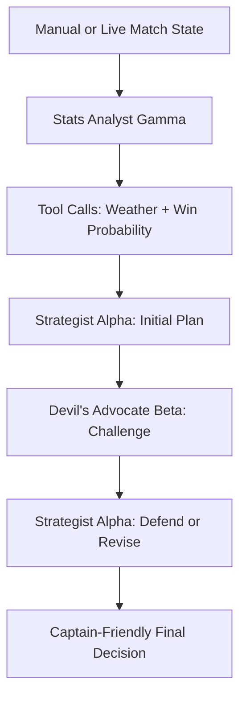
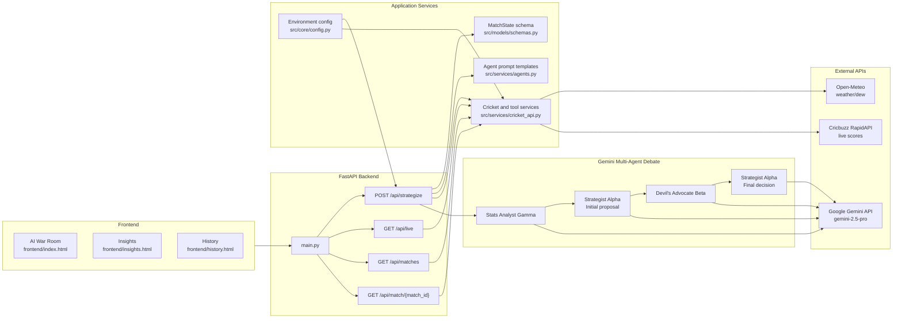

# Captain Cool

Captain Cool is a Gemini-powered IPL captaincy strategist that turns live match state into a clear tactical call. Instead of acting like a generic chatbot, it runs a visible debate between named agents, uses real tools for cricket context, and explains the final decision in language a captain, coach, or fan can understand.

Repository: `soh4n/Captain-Cool`

## Highlights

- Gemini multi-agent orchestration using `google-genai`.
- Optional Google ADK agent scaffold under `adk_agents/captain_cool`.
- Three named agents with distinct prompts: Stats Analyst Gamma, Strategist Alpha, and Devil's Advocate Beta.
- Function-tool use inside the analyst agent for weather/dew context and win-probability calculation.
- Multi-turn tactical loop: propose, challenge, defend or revise.
- Live/recent IPL support through Cricbuzz RapidAPI.
- Static frontend served by FastAPI with War Room, Insights, and History views.
- Documentation and prompt pack for a dev.to-style submission.

## How It Works



The app makes separate Gemini calls for each role. The debate trace is returned to the UI so reviewers can see the back-and-forth rather than only the final answer.

## Architecture Diagram



## Agent Roles

| Agent | Role | Output |
| --- | --- | --- |
| Stats Analyst Gamma | Reads the match state, fetches venue weather, estimates dew and win probability | Statistical brief |
| Strategist Alpha | Makes one committed tactical proposal from the captain's perspective | Initial next-over plan |
| Devil's Advocate Beta | Attacks the plan and proposes the strongest alternative | Dissent and risk case |
| Strategist Alpha Final | Responds to the critique, then defends or revises | Final decision JSON |

## Inputs

Captain Cool supports manual match-state input through the API and live-state mode through Cricbuzz:

- Innings, over, ball, score, wickets
- Batting team, bowling team, striker, non-striker
- Bowlers remaining and overs used
- Pitch conditions, venue, dew factor
- Target and required run rate for chases
- Impact Player availability
- Captain side: batting or bowling

## Tech Stack

- Python 3.10+
- FastAPI
- Pydantic
- `google-genai`
- Open-Meteo weather API
- Cricbuzz RapidAPI
- Static HTML, Tailwind CDN, Material Symbols

## Project Structure

```text
.
|-- main.py                       # FastAPI app entry point
|-- frontend/                     # Static UI screens
|-- src/
|   |-- api/                      # FastAPI routers
|   |-- core/                     # Configuration
|   |-- models/                   # Request schemas
|   |-- services/                 # Agents and cricket tools
|   `-- tests/                    # Unit tests
|-- docs/architecture.md          # Architecture notes
|-- adk_agents/                   # Google ADK-compatible agent project
|-- AI_STUDIO_PROMPT.md           # Prompt prototyping pack
|-- devto_blog.md                 # Blog draft
|-- .antigravity/                 # Local agent trace/evidence package
`-- requirements.txt
```

Generated design exports such as `stitch_assets/` are intentionally ignored and not tracked.

## Setup

Create and activate a virtual environment:

```powershell
python -m venv .venv
.\.venv\Scripts\activate
pip install -r requirements.txt
```

Create a local `.env` file from `.env.example`:

```env
GEMINI_API_KEY=your_gemini_api_key_here
RAPIDAPI_KEY=your_rapidapi_key_here
GEMINI_MODEL=gemini-2.5-pro
```

Run the app:

```powershell
uvicorn main:app --reload --port 8000
```

Open:

```text
http://localhost:8000
```

## Optional ADK Run

Captain Cool also includes a Google Agent Development Kit project that exposes the weather and win-probability tools through an ADK `root_agent`.

```powershell
cd adk_agents
adk run captain_cool
```

The ADK scaffold follows Google's documented Python pattern: `from google.adk.agents.llm_agent import Agent`, a `root_agent` definition, and tool functions supplied in the `tools` list.

## API Endpoints

| Method | Path | Purpose |
| --- | --- | --- |
| `POST` | `/api/strategize` | Runs the full Gemini agent debate |
| `GET` | `/api/live` | Gets the current live/recent IPL match state |
| `GET` | `/api/matches` | Lists live/recent IPL matches |
| `GET` | `/api/match/{match_id}` | Gets scorecard details for one match |

Example manual strategy request:

```json
{
  "live": false,
  "captain_side": "bowling",
  "innings": 2,
  "over": 15,
  "ball": 2,
  "current_score": 142,
  "wickets": 4,
  "team_batting": "CSK",
  "team_bowling": "MI",
  "striker": "Shivam Dube",
  "non_striker": "MS Dhoni",
  "bowlers_remaining": {
    "Bumrah": 1,
    "Hardik": 2,
    "Coetzee": 1
  },
  "pitch_conditions": "two-paced with medium dew",
  "venue": "Mumbai",
  "target": 188,
  "impact_player_available": true
}
```

## Verification

Run tests:

```powershell
python -m pytest src\tests
```

Current verified result:

```text
3 passed
```

## Evaluation Mapping

| Rubric Area | Evidence |
| --- | --- |
| Relevance | Cricket-specific state, captain side, match phase, bowling resources, pitch/dew, target pressure |
| Technical depth | Gemini calls per agent, function tools, FastAPI endpoints, live cricket data integration |
| Agentic design | Strategist proposal, Devil's Advocate critique, final defend-or-revise loop, optional ADK scaffold |
| Documentation | Architecture doc, AI Studio prompt pack, dev.to blog draft, `.antigravity` trace package |

## Notes For Submission

- Add a real Google AI Studio share link to `devto_blog.md` before publishing.
- If you use Google Antigravity directly, replace the local `.antigravity/` notes with the official exported traces.
- Keep `.env` local. Do not commit API keys.
- Rotate any API key that was previously committed or shared.

## License

This project is released under the MIT License. See [LICENSE](LICENSE).
