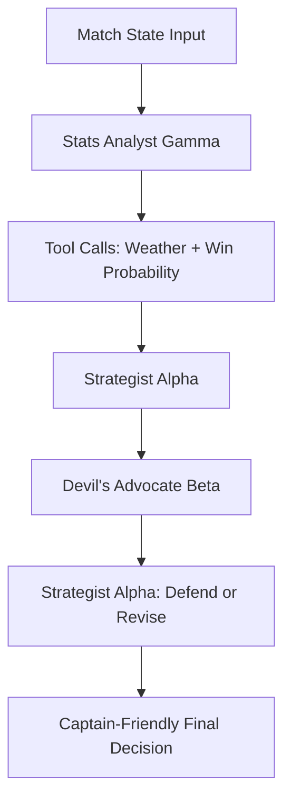

# Captain Cool: The Multi-Agent IPL Strategist

Captain Cool is built for one job: help an IPL captain make the next tactical call under pressure. The app takes score, phase, pitch, dew, target, bowling resources, and captain perspective, then lets three Gemini-powered agents argue through the decision before producing a fan-readable recommendation.

## Architecture



The agents are separate Gemini calls, not one prompt pretending to be a committee:

- Stats Analyst Gamma: uses function tools to fetch venue weather/dew context and calculate a simple win-probability baseline.
- Strategist Alpha: proposes one committed cricket decision from the captain's point of view.
- Devil's Advocate Beta: attacks the plan and proposes the strongest alternative.
- Strategist Alpha final turn: answers the objection, then defends or revises the call.

The repo also includes an optional Google ADK scaffold in `adk_agents/captain_cool`, where `root_agent` exposes the cricket weather and win-probability tools through ADK's Python `Agent` interface.

AI Studio prompt prototype: add the shared AI Studio link here before publishing. The local prompt pack is in `AI_STUDIO_PROMPT.md`.

## System Prompts

### Stats Analyst Gamma

```text
You are the Stats Analyst for an elite IPL captaincy AI system called "Captain Cool."

The captain is the batting or bowling side captain. Frame all your analysis from their perspective. Receive raw match state inputs and return a clean, structured statistical brief for the other agents. Do not make the tactical decision yourself. Call get_venue_weather and calculate_win_probability.
```

### Strategist Alpha

```text
You are the Strategist, the senior tactical brain inside Captain Cool.

Make one clear tactical decision for the next over or moment. Explain it like a world-class captain would to the coaching staff. Think in overs and phases, not generic model language. You speak cricket.
```

### Devil's Advocate Beta

```text
You are the Devil's Advocate inside Captain Cool.

Challenge the Strategist's tactical call hard. Find the single strongest objection, identify matchup or phase risk, and build the best possible case for a different decision.
```

## Match Scenario

Input:

- Innings: 2, target 188
- Score: 142/4 after 15.2 overs
- Batting: CSK, with Shivam Dube on strike and MS Dhoni non-striker
- Bowling: MI, with Bumrah 1 over left, Hardik 2, Coetzee 1
- Venue: Mumbai, two-paced surface, medium dew
- Impact Player: available

Stats Analyst Gamma reports that the chase is close but tilting tense: the required rate is above ten, wickets are still in hand, and dew is reducing grip for cutters.

Strategist Alpha proposes holding Bumrah for the 18th and 20th, using Hardik's cutters wide of off stump, and protecting the leg-side boundary.

Devil's Advocate Beta challenges the plan: Dube likes that pace range, and if he takes Hardik down now, the death overs may arrive with the match already gone.

Final decision: bring Bumrah now, attack Dube with yorkers and wide-line pace, and accept that the 20th over may need to be shared. The captain's one-line call is: "Break this pair before saving the over becomes pointless."

Counterfactual: if MI stay with Hardik's cutters here, the model's cricket logic estimates the batting side gains momentum because Dube's hitting arc matches that plan.

## Screenshots

Add final screenshots before publishing:

- `stitch_assets/747abdc212af485781a107c153e5cc5e_screenshot.png`
- `stitch_assets/Insights.png`
- `stitch_assets/Match history.png`

## What Still Needs Proof

The repository includes a transparent `.antigravity/` evidence package with commit history notes and agent traces from the local build session. If you used Google Antigravity directly, replace those notes with the official exported workspace traces before publishing the final post.
