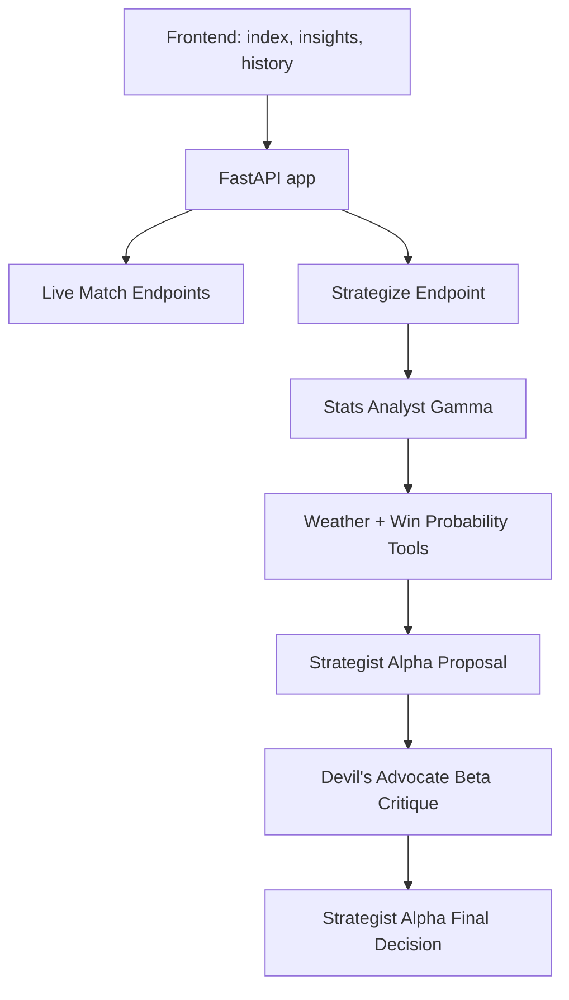

# Architecture

Captain Cool is a FastAPI web app with a static HTML frontend and a Gemini-powered decision pipeline.

## Runtime Flow

1. The frontend calls `/api/live`, `/api/matches`, or `/api/strategize`.
2. Live cricket data comes from Cricbuzz RapidAPI when `RAPIDAPI_KEY` is set.
3. `/api/strategize` builds a match-state briefing from live or manual inputs.
4. Gemini call 1 runs Stats Analyst Gamma with function tools.
5. Gemini call 2 runs Strategist Alpha for the first tactical proposal.
6. Gemini call 3 runs Devil's Advocate Beta to challenge the plan.
7. Gemini call 4 runs Strategist Alpha again to defend or revise the decision.

## Agent Roles

| Agent | Purpose | Temperature |
| --- | --- | --- |
| Stats Analyst Gamma | Facts, weather, dew, win-probability context | 0.2 |
| Strategist Alpha | One committed next-over tactical proposal | 0.7 |
| Devil's Advocate Beta | Strongest objection and alternative call | 0.8 |
| Strategist Alpha Final | Defend or revise, then explain to fans | 0.7 |

## External Tools

- `get_venue_weather(city)`: Open-Meteo geocoding and weather lookup.
- `calculate_win_probability(...)`: simple T20 chase pressure estimate.
- Cricbuzz RapidAPI: live/recent IPL matches and scorecards.

## Optional ADK Agent

The repository includes an ADK-compatible project at `adk_agents/captain_cool`. It defines a `root_agent` with Google ADK's Python `Agent` class and reuses the same weather and win-probability tools as the FastAPI debate pipeline.

## Submission Evidence Needed

The code proves Gemini orchestration and tool use. For a top-score submission, add real evidence for the non-code workflow:

- Google Antigravity session traces or `.antigravity/` export.
- A shareable Google AI Studio prompt link.
- Final UI screenshots embedded in the blog post.
